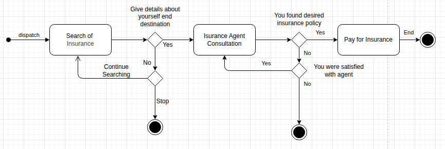

## Activity Diagram Description

This activity diagram shows the workflow for selecting and purchasing an insurance policy. The process starts with the user searching for insurance options. The user then provides personal and destination details, which leads to a consultation with an insurance agent. If the user is satisfied with the agent, the search continues with agent input; otherwise the process ends. After consultation, the user decides whether the desired policy has been found. If yes, the user pays for the insurance and the process ends. If no, the user can either continue searching or stop, ending the process.
