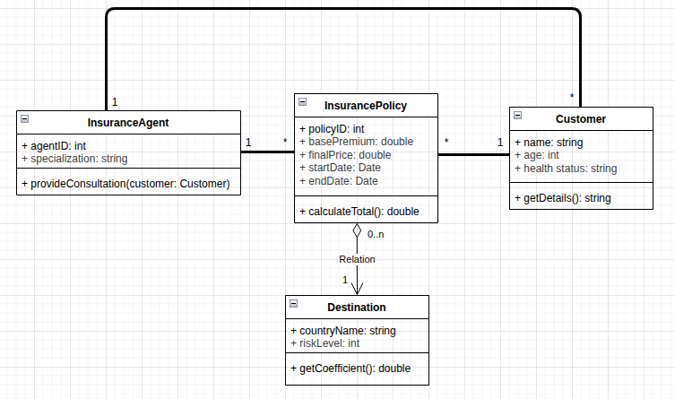

## Class Diagram Description

This class diagram models a travel insurance domain. It defines the core
entities needed to quote and manage an insurance policy and shows how they
relate to each other.

#CLASSES
- InsuranceAgent: represents an agent who advises customers. It stores the
	agent identifier and specialization, and can provide consultation to a
	specific customer.
- Customer: represents the buyer. It stores personal and health information and
	can return its details for quoting.
- InsurancePolicy: represents a policy quote or contract. It contains the base
	premium, final price, and coverage dates, and can calculate the total price.
- Destination: represents the travel destination with a risk level used to
	adjust pricing.

#RELATIONS
- InsuranceAgent 1..* InsurancePolicy: one agent can manage many policies, but
	each policy is handled by exactly one agent. This keeps responsibility clear
	for consultations and policy management.
- Customer 1..* InsurancePolicy: one customer can have multiple policies over
	time, but each policy belongs to a single customer. This reflects real-world
	ownership and billing.
- InsurancePolicy o-- Destination (aggregation) with 0..n destinations to 1
	destination: a policy can be linked to zero or more destinations (for multi-
	trip coverage), while each destination entry refers to one place. Aggregation
	is used because destinations exist independently and can be reused across
	policies.

#WHY THESE RELATIONS
The multiplicities capture how many objects can be associated at once and
protect data integrity. The aggregation between InsurancePolicy and Destination
indicates a loose "has-a" relationship: the policy uses destination data to
calculate risk and pricing, but destinations are not owned exclusively by a
single policy.
