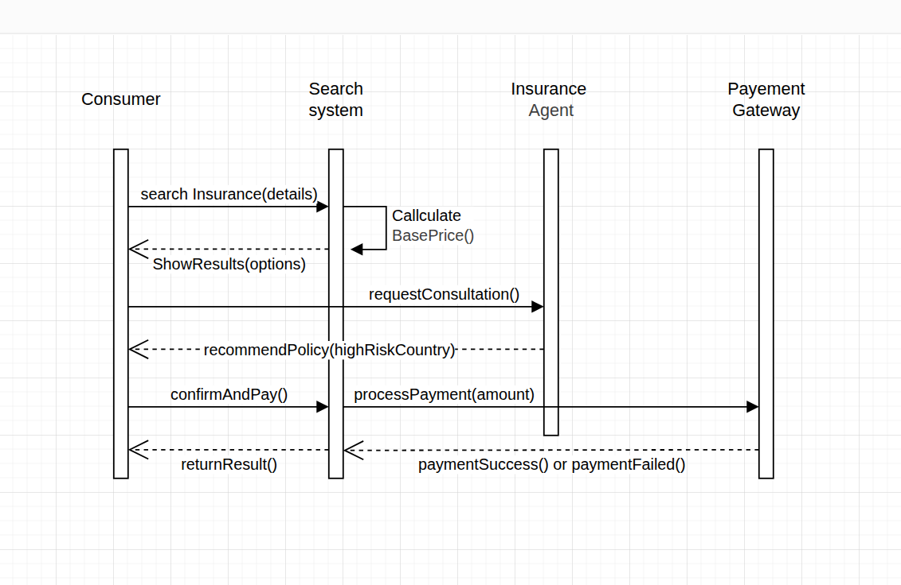

## Sequence Diagram Description

This sequence diagram models the interaction for searching and purchasing insurance. The Consumer submits search details to the Search System, which calculates a base price and returns available options. The Search System requests a consultation from the Insurance Agent, who recommends a policy for the given risk context. If the Consumer confirms and pays, the Search System sends the payment amount to the Payment Gateway. The Payment Gateway returns either a success or failure response, and the Search System returns the final result to the Consumer.
