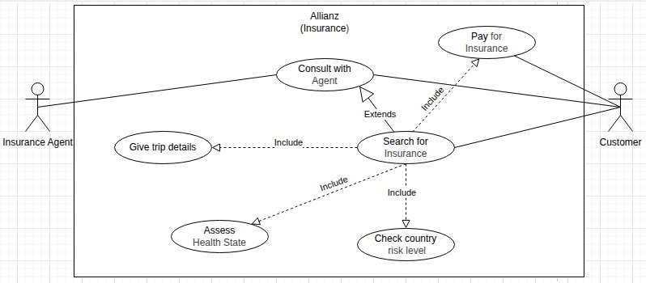

## Use-Case Diagram Description

This use case diagram models the Allianz (Insurance) system for travel insurance.
Two actors interact with the system: the Customer (Buyer) and the Insurance Agent.
The Customer can search for insurance and then pay for insurance once a suitable
option is found. The Insurance Agent can consult with the Customer to provide
assistance during the search process.

The main use case is Search for Insurance. This use case includes providing trip
details, assessing the Customer's health state, and checking the destination
country risk level. The Consult with Agent use case extends the search process
when the Customer needs guidance. After the search is completed, the Customer
can proceed to Pay for Insurance.